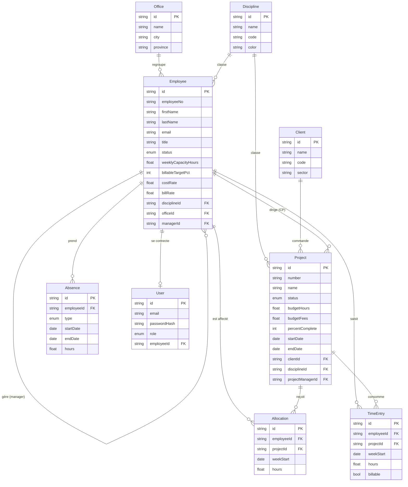

# Modèle de données

PostgreSQL via Prisma. Schéma complet : [`prisma/schema.prisma`](../prisma/schema.prisma).

## Diagramme entités-relations

## Entités

| Entité | Rôle |
|---|---|
| **Office** | Bureaux (Montréal, Québec, Gatineau). |
| **Discipline** | Électricité, Mécanique/CVAC, Plomberie, Protection incendie, Contrôles. Porte une couleur pour les graphiques. |
| **Employee** | Membre de l'équipe : poste, discipline, bureau, gestionnaire, capacité hebdomadaire, cible de facturation, taux coût/facturable. |
| **Client** | Donneur d'ouvrage. |
| **Project** | Mandat : budget heures/honoraires, avancement, échéancier, chargé de projet, discipline. |
| **Allocation** | Heures **planifiées** par employé / projet / semaine (le « prévu »). |
| **TimeEntry** | Heures **réalisées** par employé / projet / semaine (le « réel »), facturables ou non. |
| **Absence** | Vacances, congés, formation — réduisent la disponibilité réelle. |
| **User** | Compte de connexion (NextAuth), lié optionnellement à un employé. |

## Choix de modélisation

- **Prévu vs réel séparés** (`Allocation` vs `TimeEntry`) : permet de comparer planification et exécution (utilisation prévue, % réalisé, dérives).
- **Granularité hebdomadaire** (`weekStart` = lundi UTC) : suffisante pour la planification de capacité, volume de données maîtrisé.
- **Montants en `Float`** pour le MVP ; migrer vers `Decimal` en production pour une précision comptable.
- **Énumérations** (`ProjectStatus`, `AbsenceType`, `EmployeeStatus`, `UserRole`) pour l'intégrité des statuts.
